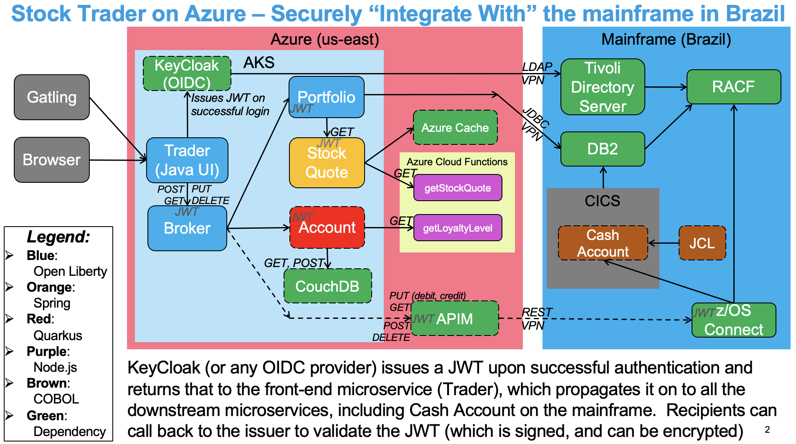

# Cash Account (Cobol)
CICS/COBOL implementation of Cash Account, for use in mainframe modernization "integrate with" scenarios.  Business logic is implemented in COBOL that is deployed to CICS, along with some JCL batch jobs.  It uses DB2 for z/OS for persistence, and VSAM for caching.  It is exposed via z/OS Connect, and is secured via JWTs issued by KeyCloak (OIDC) running in AKS, backed by Tivoli Directory Server (LDAP) running on the mainframe, backed by RACF.  It conforms to the exact some [OpenAPI signatures](https://github.com/IBMStockTrader/cash-account/blob/main/src/main/resources/api-docs.yaml) as the Java Spring version of this microservice.

Stay tuned for a series of articles on [Medium](https://medium.com/cloud-journey-optimization) describing our journey enabling Stock Trader to "integrate with" this business logic on the mainframe.
